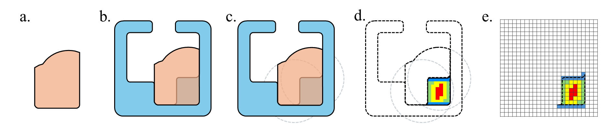

# FlexVASP-S
A preliminary implementation of FlexVASP-S as a flexible steric-aware 3D geometric framework for explaining protein binding specificity.




This is the first interpretable 3D geometic learning framework that identifies regions of hindrance in binding cavities that select for different ligands.  FlexVASP-S identifies these regions despite noisy conformational variations by using flexible structural representations and explainable AI techniques.

## Usage

### Setup
The whole implementation is built upon [PyTorch](https://pytorch.org) and [PyTorch Geometric](https://pytorch-geometric.readthedocs.io/en/latest/)

**conda**

See the `environment.yml` for environment configuration. 
```bash
conda env create -f environment.yml
```

**PYG**

To install pyg library, [please refer to the document](https://pytorch-geometric.readthedocs.io/en/latest/notes/installation.html)

### Dataset 
The preprocessed dataset has been shared in public.
